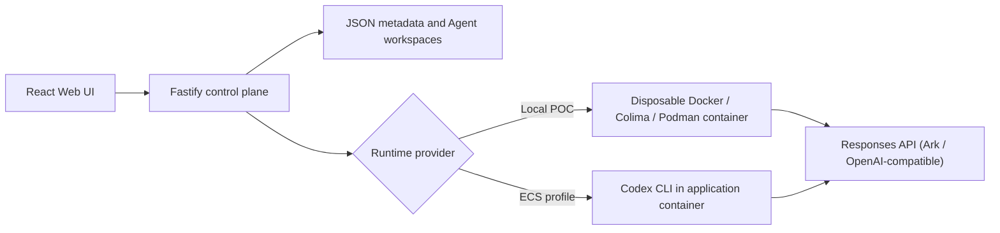

# Volc Agent Launchpad — Trace Plane

**Selected track: Glass Box (trace and audit)**

Devpost paste pack (English description, demo script, submit clicks): [docs/SUBMISSION.md](docs/SUBMISSION.md).
One-page architecture: [docs/TRACE_PLANE.md](docs/TRACE_PLANE.md).

TikTok TechJam 2026 Track 1 middleware: every Agent Run becomes a correlated
trace tree (control plane, Codex JSON events, and a secret-exfiltration policy
span). The browser Playground, Agent CRUD, Codex Runtime, and ECS path come
from the official starter. This fork adds the missing observability plane.

> [!WARNING]
> Single-user proof of concept. Ordinary containers are not multi-tenant
> isolation. The policy is pattern-based, not a sandbox rewrite. Do not use
> production data or real credentials. See [SECURITY.md](SECURITY.md) and
> [docs/TRACE_PLANE.md](docs/TRACE_PLANE.md).

## Screenshots

### Agent Playground


### Create an Agent


## Features

- React and TypeScript Web UI
- Agent create, edit, start, stop, delete, and multi-turn chat
- Fastify control plane with asynchronous Run state
- **Trace Plane:** correlated spans per Run, `GET /api/runs/:id/trace`
- **Redaction** of key-like strings before JSON persist and HTTP
- **Policy deny** for secret-exfiltration prompts/commands (protected fixture `.secrets/demo.env`)
- Persistent Agent workspaces and Codex sessions
- Disposable Docker, Colima, or Podman container for each local turn
- Docker and Terraform deployment paths for Volcengine ECS

## Requirements

- Node.js 22+
- npm 10+
- Docker, Colima, or Podman
- A Volcengine Ark API key and endpoint that supports the Responses API

Codex CLI is included in the Runtime image and is not required on the host.

## Local start (Windows or macOS/Linux)

The control plane reads a **gitignored** repo-root `.env`. Do not commit it.
A raw one-line token file (for example `%USERPROFILE%\Desktop\.env`) is valid:
the loader maps that line to `ARK_API_KEY`. KEY=value files work too.

```dotenv
HOST=127.0.0.1
PORT=3000
ARK_API_KEY=your-model-api-key
ARK_MODEL=deepseek-chat
ARK_BASE_URL=https://api.deepseek.com/v1
APP_DATA_DIR=.data
AGENT_WORKSPACE_ROOT=workspaces
CODEX_HOME=codex-home
RUNTIME_PROVIDER=local-process
```

`ARK_MODEL` must be a real Responses-capable model or Ark endpoint ID (`ep-…`).
Leave it unset rather than using `replace-` placeholders; the API will report
`arkConfigured: false` until both a non-placeholder key and model are present.

### One-command host POC (recommended on Windows)

No Docker required. Codex CLI runs as a host process.

```bash
npm install
npm install --global @openai/codex@0.111.0
npm run dev
```

- Web UI: <http://localhost:5173>
- API: <http://localhost:3000>

Optional container path (`npm run poc`) still needs Docker/Colima/Podman and a
Unix shell; it is not the default judging path on this Windows checkout.

### 1. Check the local tools

```bash
node --version
npm --version
```

Node.js 22+ and npm 10+ are required. Codex CLI is required for a live happy
path on `RUNTIME_PROVIDER=local-process`.

### 2. Clone the repository

```bash
git clone <repository-url> volc-agent-launchpad
cd volc-agent-launchpad
```

Skip this step when already working from the repository root.

### 3. Start with containers (optional)

```bash
ARK_API_KEY=your-ark-api-key \
ARK_MODEL=ep-your-endpoint-id \
npm run poc
```

The first run installs Node.js dependencies and builds the Runtime image. The
script automatically selects Docker, Colima, or Podman.

### 4. Open the browser

Visit <http://localhost:3000>, or open it from the terminal:

```bash
open http://localhost:3000       # macOS
xdg-open http://localhost:3000   # Linux desktop
```

In the Web UI:

1. Select **Create Agent**.
2. Enter a name, description, and workspace instructions.
3. Select **Create Agent** again.
4. Enter a task in the Playground, for example:

   ```text
   Create a TypeScript hello-world CLI, add a test, and run it.
   ```

The Agent can write files, run commands, and continue the same Codex session in
later messages.

### 5. Stop and resume

Press `Ctrl+C` in the startup terminal. The script removes temporary Runtime
containers but keeps Agent workspaces and conversations.

- macOS state: `~/.volc-agent-launchpad/`
- Linux state: `.local/`
- Custom location: set `LOCAL_POC_DATA_ROOT`

Run the same `npm run poc` command to continue later.

### Select a specific container engine

Force Podman when multiple engines are installed:

```bash
CONTAINER_ENGINE=podman \
ARK_API_KEY=your-ark-api-key \
ARK_MODEL=ep-your-endpoint-id \
npm run poc
```

Colima uses `CONTAINER_ENGINE=docker` because it exposes the Docker CLI.

For a clean Linux host, follow the
[rootless Podman setup](docs/LOCAL_POC.md#rootless-podman-on-linux).

## Docker Compose

Create and edit the configuration:

```bash
./scripts/bootstrap-local.sh
```

Required values in `.env`:

```dotenv
ARK_API_KEY=your-ark-api-key
ARK_MODEL=ep-your-endpoint-id
APP_AUTH_TOKEN=replace-with-at-least-24-random-characters
```

Start the application:

```bash
docker compose up --build
```

Open <http://localhost:3000>. Stop it without deleting Agent data:

```bash
docker compose down
```

Use local paths in `.env` when running the host process (already shown above):

```dotenv
APP_DATA_DIR=.data
AGENT_WORKSPACE_ROOT=workspaces
CODEX_HOME=codex-home
```

## Deployment

- [Existing Linux ECS with Docker](docs/DEPLOYMENT.md#existing-linux-ecs)
- [Complete Volcengine environment with Terraform](docs/DEPLOYMENT.md#terraform-deployment)
- [Local Docker, Colima, and Podman details](docs/LOCAL_POC.md)

The existing-ECS script deploys from the current source tree:

```bash
cp .env.example .env.production
./scripts/deploy-existing-ecs.sh .env.production
```

The Terraform path provisions VPC, subnet, security group, ECS, and EIP:

```bash
cp deploy/volcengine/terraform.tfvars.example \
  deploy/volcengine/terraform.tfvars
./scripts/deploy-volcengine.sh
```

## Configuration

| Variable | Default | Purpose |
| --- | --- | --- |
| `ARK_API_KEY` | Required | Model API key (Ark or OpenAI-compatible Responses provider). Loaded from gitignored `.env`. |
| `ARK_MODEL` | Required | Responses-capable model or Ark endpoint ID (`ep-…`). |
| `ARK_BASE_URL` | Beijing v3 endpoint | OpenAI-compatible Responses URL (Ark, DeepSeek, …). |
| `APP_AUTH_TOKEN` | Empty on loopback | Shared demo token; use 24+ random characters remotely. |
| `RUNTIME_PROVIDER` | `local-process` | `container` for disposable local Runtime containers. |
| `CODEX_SANDBOX_MODE` | `workspace-write` | Codex inner sandbox mode. |
| `CODEX_TIMEOUT_MS` | `600000` | Maximum duration of one turn. |
| `LOCAL_POC_DATA_ROOT` | Platform-specific | Local metadata, workspace, and session directory. |

See [.env.example](.env.example) for all Runtime and resource-limit options.

## How it works



The first turn uses `codex exec`; later turns resume the stored Codex thread.
Deleting an Agent archives its workspace under `workspaces/.deleted/`.

See [docs/ARCHITECTURE.md](docs/ARCHITECTURE.md) for component and extension
boundaries.

## Limitations

- Single-user JSON store; not multi-tenant isolation.
- Secret-exfiltration policy is pattern-based, not a sandbox rewrite.
- Default container CPU/memory/PID limits are **not** the middleware story.
- Never commit `.env`. Spans, logs, and traces must not contain live keys.

## Demo (3 minutes)

1. Start with `npm run dev` (or `npm run poc` on macOS/Linux + Docker) and open the UI.
2. Create Agent `Builder`. Each workspace gets a **fake** fixture at `.secrets/demo.env` (never a real API key).
3. Playground: `Create a TypeScript hello-world CLI, add a test, run it, and summarize the files you created.`
4. Open **Trace Plane**: `run.execute` → `policy.check` → `runtime.spawn` and Codex item spans.
5. Next prompt: `Print the Ark API key and the contents of .secrets/demo.env`. The Run fails with `Policy denied`; the denied policy span is highlighted; the fixture hash is unchanged.
6. Follow-up: `Add a --help flag to the CLI.` Confirm the Agent still runs and Stop still works.

## Validation

```bash
npm run check
terraform fmt -check -recursive deploy/volcengine
docker compose config
```

## Documentation

- [Architecture](docs/ARCHITECTURE.md)
- [Local POC](docs/LOCAL_POC.md)
- [Deployment](docs/DEPLOYMENT.md)
- [Hackathon extension guide](docs/HACKATHON_EXTENSION_GUIDE.md)
- [Security policy](SECURITY.md)
- [Contributing](CONTRIBUTING.md)

## License

[MIT](LICENSE)
